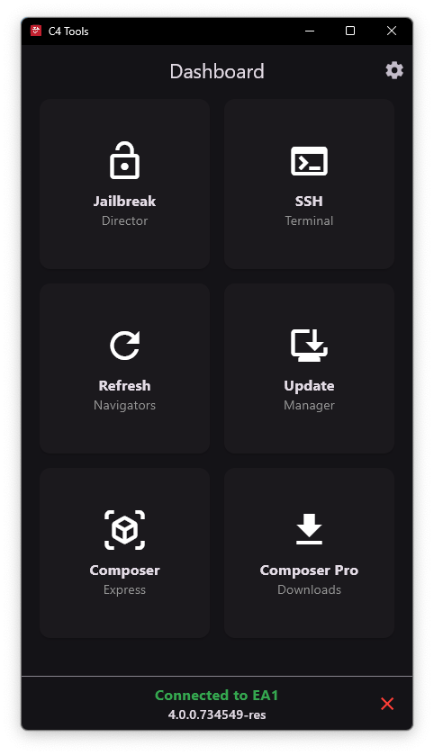
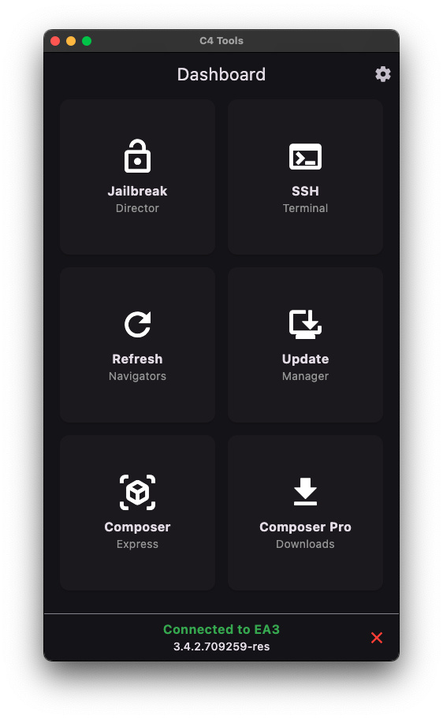
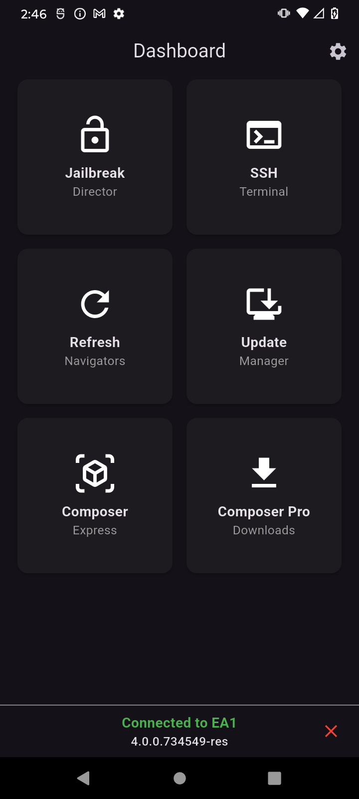
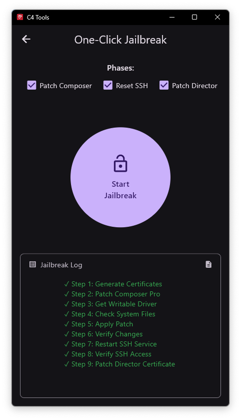
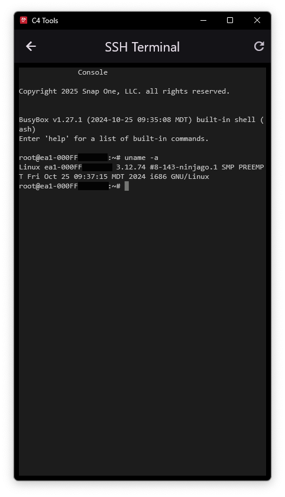
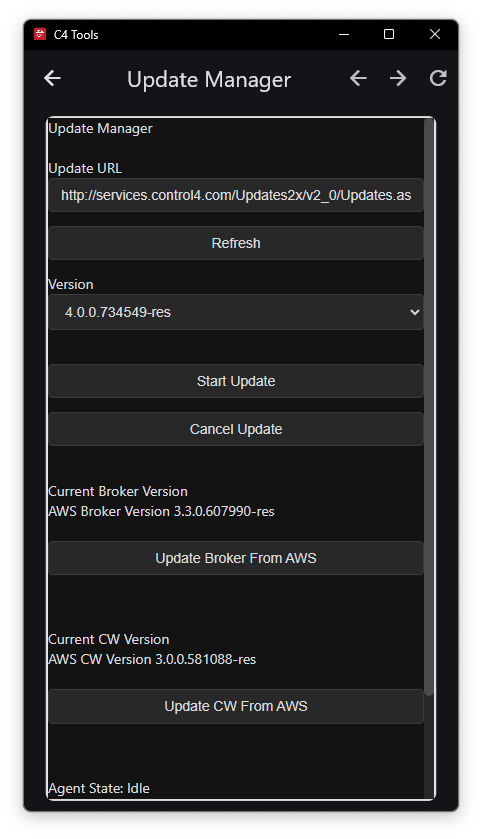
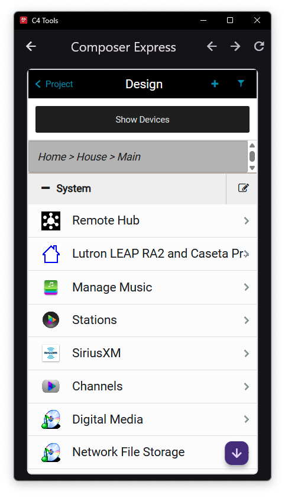
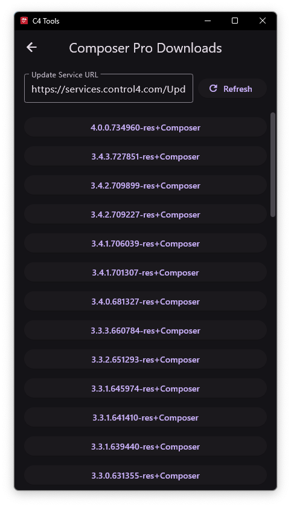

# C4 Tools

  

> _Screenshots of the app on Windows, macOS, and Android_

<b>C4 Tools</b> is a cross-platform utility for managing and enhancing Control4 systems. It provides a suite of tools to jailbreak, update, and manage your Control4 Director, as well as access Composer Express on any supported platform.

<b>Note:</b> This tool has been tested to work with OS 3.3.0 through OS 4.0.0 (X4). It may work on higher or lower versions.

> ⚠️ **Disclaimer:** You use this tool at your own risk. There is no warranty or guarantee that it will work as expected. Using this tool could potentially break your Control4 system, void warranties, or cause data loss. The authors and contributors are not responsible for any damage or issues that may arise from its use.

## Support

If this tool is helpful to you and you want to consider supporting its continued development:<br>
<br><a href="https://www.buymeacoffee.com/bphillips09" target="_blank"></a>

## Features

### 1. One-Click Jailbreak
<table>
  <tr>
    <td align="center" width="200"></td>
    <td>
      <b>Jailbreak</b> your Control4 system with a single click.<br><br>
      <b>Note:</b> Full jailbreak functionality is only available on Windows.
    </td>
  </tr>
</table>

---
### 2. SSH Terminal
<table>
  <tr>
    <td align="center" width="200"></td>
    <td>
      Open an SSH terminal directly to the Director for advanced management and troubleshooting.
    </td>
  </tr>
</table>

---
### 3. Update Director
<table>
  <tr>
    <td align="center" width="200"></td>
    <td>
      Easily update your Director to the latest supported firmware.
    </td>
  </tr>
</table>

---
### 4. Composer Express
<table>
  <tr>
    <td align="center" width="200"></td>
    <td>
      Download and use the <i>Composer Express</i> mobile app on <b>any platform</b>.<br><br>
      <b>Note:</b> C4 Tools does not come bundled with Composer Express, but will automatically download and install it for you.
    </td>
  </tr>
</table>

---
### 5. Composer Pro Downloads
<table>
  <tr>
    <td align="center" width="200"></td>
    <td>
      Download the latest version of Composer Pro directly.
    </td>
  </tr>
</table>

## Running the App
1. Download the [latest Release](https://github.com/bphillips09/C4-Tools/releases/latest) for your desired platform
2. Unzip and Open the application
- If you're on Windows, you'll need to run as Administrator to be able to modify Composer Pro
- If you're on macOS, you may need to right-click the application and select `Open` to allow it to run

## Building from Source

1. **Install Flutter**: [Flutter installation guide](https://docs.flutter.dev/get-started/install)
2. **Clone this repo:**
   ```sh
   git clone https://github.com/bphillips09/C4-Tools.git
   cd C4-Tools
   ```
3. **Build or run the app:**
   ```sh
   flutter build
   #or 
   flutter run
   ```
